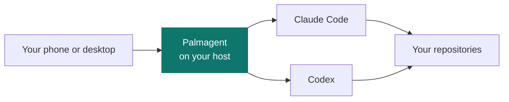

<div align="center">
  
  <h1>Palmagent</h1>
  <p><strong>A mobile-first, self-hosted dispatcher for Claude Code and Codex.</strong></p>
  <p>Start coding tasks, follow their progress, and pick up from your phone or desktop.</p>
  <p>
    <a href="https://github.com/incipienstation/palmagent/releases">
      
    </a>
    <a href="LICENSE">
      
    </a>
  </p>
  <p>
    <a href="#quick-start">Get started</a> ·
    <a href="docs/USER-GUIDE.md">User guide</a> ·
    <a href="docs/HOST-INGRESS.md">Host setup</a> ·
    <a href="#development">Development</a>
  </p>
</div>

## How it works



## What you can do

| Capability | What it does |
| --- | --- |
| **Coordinate coding tasks** | Run Claude Code and Codex from one interface, see live progress, and queue follow-up messages with the [persistent message queue](docs/MESSAGES.md). |
| **Keep project context** | Find repositories through server-side [Spaces](docs/USER-GUIDE.md#space-search-paths) and schedule [routines](docs/USER-GUIDE.md#routines). |
| **Move between app and CLI** | [Hand off native CLI sessions](docs/USER-GUIDE.md#sessions-and-working-directories) or use [persistent Task and Space shells](docs/terminals.md). |
| **Manage from one place** | Use the Palmagent operator plugin to manage service setup, [release channels](docs/USER-GUIDE.md#choose-a-release-channel), and [updates](docs/USER-GUIDE.md#updates). |

## Quick start

Install the Palmagent plugin for Claude Code or Codex from a published `v<version>` tag. Use a
stable release tag for Stable or a prerelease tag for Preview.

### Claude Code

```text
/plugin marketplace add https://github.com/incipienstation/palmagent.git#v<version>
/plugin install palmagent@palmagent
```

### Codex

```bash
git clone --depth 1 --branch 'v<version>' https://github.com/incipienstation/palmagent.git '/abs/path/to/palmagent-v<version>'
codex plugin marketplace add '/abs/path/to/palmagent-v<version>/plugins/codex'
codex plugin add palmagent@palmagent
```

Keep the Codex checkout at its original path because it is the local marketplace source. See the
[Codex plugin guide](plugins/codex/README.md) for version changes and recovery.

After installing, start a new agent session and ask it to install Palmagent. Stable is the default
channel for a new installation. To opt into Preview, ask the plugin: **“Use Preview for Palmagent.”**

## Before you expose Palmagent

> [!IMPORTANT]
> Agent processes run on the Palmagent host with the service account's access to files and tools.
> Choose repository paths and account access deliberately. The runtime binds to loopback; public
> access requires an HTTPS reverse proxy. See [host ingress and migration](docs/HOST-INGRESS.md) for
> setup and transport details.

## Documentation

| Guide | Covers |
| --- | --- |
| [User guide](docs/USER-GUIDE.md) | Spaces, routines, sessions, release channels, and updates |
| [Message delivery](docs/MESSAGES.md) | Queues, delivery behavior, and recovery |
| [Native supervisor](docs/DAEMON.md) | Rust runtime, OS adapters, updates and migration |
| [Session lifecycle](docs/SESSION-LIFECYCLE.md) | Session ownership and application updates |
| [Persistent shells](docs/terminals.md) | Task and Space shell access |
| [Skills](docs/SKILLS.md) | Selecting skills for messages |
| [Host ingress](docs/HOST-INGRESS.md) | HTTPS access, setup, and migration |
| [Web app development](apps/web/README.md) | Frontend development and UI checks |

## Development

The [backend architecture policy](docs/ARCHITECTURE.md) defines feature ownership,
ports, adapters, composition and dependency checks. Native runtime builds also require
rustup and the toolchain pinned in [`rust-toolchain.toml`](rust-toolchain.toml).

Use the Node.js version in [`.nvmrc`](.nvmrc) and the pnpm version pinned in
[`package.json`](package.json):

```bash
nvm install
nvm use
pnpm install
pnpm dev
```

To run the web app, start `pnpm web:dev` in another terminal. Run
`node scripts/verify-local.mjs` to select checks for the complete change.

## License

[MIT](LICENSE)
