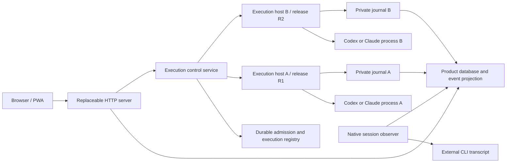

# Session lifecycle and independent application updates

Status: design for staged implementation. This document does not describe an
already deployed capability. The existing updater's idle guard remains necessary
until the migration gates below pass.

## Decision

Make the browser and HTTP server replaceable clients of an independent execution
service. Give every Palmagent-started agent invocation an execution host that
owns its provider adapter, child process, input channel, and durable execution
state until that invocation finishes. Application updates never restart those
hosts. New invocations use the newly activated release; existing invocations keep
their original release.

Keep external terminal sessions externally owned. Viewing a transcript, deploying
Palmagent, or reconnecting a browser never transfers that ownership or resumes a
provider session. A provider session is conversation history; an execution is a
specific live invocation. Preserving history or resuming a session is not proof
that an execution survived.

Continue publishing one product version and one npm distribution. Separate
installation, activation, and execution lifetimes inside that distribution;
separate npm packages are not required for process isolation.

## Why the present boundary is insufficient

The baseline inspected for this design is `d68545c` on `develop`.

| Current component | Coupling that must change |
| --- | --- |
| [runner-daemon.ts](../apps/server/src/runner-daemon.ts) | Owns all agent children in one service, retains output in memory, and loses those children when its service stops. |
| [claude.ts](../apps/server/src/claude.ts), [codex.ts](../apps/server/src/codex.ts) | Provider protocol handling runs in the web process, including Claude input/control responses and end-of-turn behavior. Preserving only the CLI PID does not preserve this controller. |
| [service.ts](../apps/server/src/service.ts) | Owns execution transitions, replay reconstruction, pending steering, and restart recovery alongside HTTP-facing task behavior. Failed discovery can lead to an interrupted projection without proving process exit. |
| [runtime.ts](../apps/server/src/runtime.ts), [supervisor.ts](../apps/server/src/supervisor.ts) | A runner connection failure can select the in-process backend; concurrency and queued callbacks depend on web-process memory. |
| [install.ts](../apps/server/src/cli/install.ts), [units.ts](../apps/server/src/cli/units.ts) | In-place package replacement and conditional runner restart require a broad idle guard even for a view-only change. |
| [db.ts](../apps/server/src/db.ts) | Web startup performs migrations and execution recovery against the same database used for product state. |

The existing separate web and runner services are useful groundwork. The target
also separates protocol ownership, storage, admission, and artifact retention.

## Ownership and process topology

These are ownership boundaries on one self-hosted machine, not a requirement for
containers, a distributed queue, or additional network services. A journal
projector can run inside the HTTP service because projection is replayable;
provider execution must continue when projection stops.

| Component | Owns | Behavior when replaced |
| --- | --- | --- |
| PWA | Local drafts, attachments, navigation and display | Checkpoints and reconnects; sends no lifecycle commands during update. |
| HTTP server | Authentication, API validation, product metadata and public SSE | Replays execution events; does not reconstruct or drive provider protocols. |
| Execution control service | Durable queue, admission, routing, command acceptance and execution registry | Recovers records and discovers existing execution units; does not own their process groups. |
| Per-execution host | Frozen provider adapter, child stdin/stdout, pending questions, terminal state and journal | Is never replaced during its execution. A host failure affects that execution and is reported honestly. |
| Native session observer | Read-only external transcript synchronization | Reconnects without adopting, signalling, or resuming the external process. |
| Updater | Artifact staging, compatibility preflight, application activation and retention | Can activate application components and select the default for new hosts; cannot stop active execution units. |

Use individually named systemd services for execution hosts, created through an
owner-authorized local launcher. The service manager starts them independently
of the HTTP and control service cgroups. Each host and its agent share their own
execution cgroup with `KillMode=control-group` and no automatic invocation restart.
Do not attach execution units to application stop/restart dependencies such as
`PartOf=`. A resource slice can cap aggregate execution resources without making
application restart stop that slice. Retain existing per-execution limits and a
global admission cap rather than multiplying the old aggregate allowance per run.

Merely setting `detached: true`, `unref()`, or `KillMode=process` is insufficient:
stdio and controller ownership still matter. systemd's default stop behavior
terminates a unit's cgroup; its documentation discourages escaping that lifecycle
with `KillMode=process` or `none`. Use separate units instead. See the
[systemd kill policy](https://github.com/systemd/systemd/blob/main/man/systemd.kill.xml).

## Execution identity and control contract

Put validated, versioned wire schemas in `packages/shared`. Keep provider-specific
protocol parsing inside the execution host. Replace raw `stdin`, arbitrary
commands, and OS signals at the application boundary with typed operations.

| Identity | Meaning |
| --- | --- |
| `taskId` | Product task across multiple invocations. |
| `providerSessionId` | Provider conversation identity, scoped by provider and provider home. |
| `executionId` | Unique invocation; never reuse a task ID as the invocation ID. |
| `releaseId` | Immutable artifact identity used by this execution host. |
| `ownerEpoch` | Fencing value for control ownership; a reconnect does not advance it. |
| `commandId` | Durable idempotency key for one user intent. |
| `seq` | Monotonic event position within one execution journal. |

The local control contract includes `GetExecution`, `Subscribe(afterSeq)`,
`StartExecution`, `AnswerQuestion`, `SteerExecution`, and `CancelExecution`.
Commands include the execution identity, ownership epoch, and expected question
or state revision where applicable. Return accepted/completed/rejected/unknown
receipts; a socket write is not proof that a command completed. Reusing a command
ID with different content is rejected. Observation and subscription never start,
resume, release, or cancel an execution.

A start transaction durably records the intent, reserves a concurrency slot,
claims the provider-session/worktree ownership key, and pins a release before
launch. A single fenced admission owner reconciles that record with a deterministic
systemd unit name. The execution host also obtains an exclusive execution lock
before starting the CLI. On restart, reconcile the unit and process identity
before launching; never infer absence from one failed connection. Uncertain
launches keep their slot until reconciled, so two control-service generations
cannot launch the same invocation or exceed the cap.

The host persists command acceptance before acting and its result afterward.
Idempotent retries return the recorded result. Provider stdin and a SQLite
transaction cannot commit atomically: if the host dies between sending a command
and recording its result, record an uncertain outcome and reconcile provider
state where supported. Never blindly resend a prompt, approval, or tool-triggering
command. This design promises durable intent and duplicate suppression, not
exactly-once external side effects across arbitrary crashes.

Use private owner-only sockets and authenticated application authorization for
each command. The launcher accepts validated execution IDs and installed artifact
references, not browser-supplied shell commands or arbitrary unit properties.
Keep credentials and private provider payloads out of unit names, process
arguments, public events, and release receipts.

## Persistence and recovery

Separate execution authority from product projections:

- A stable execution registry holds ownership, queue/admission state, pinned
  artifact references, process identity, and command routing. Its schema changes
  independently of web startup and is explicitly versioned.
- Each execution host writes a private local SQLite journal containing normalized
  events, pending input, command receipts, and terminal state. Provider-private
  records, when necessary, use a separate private representation and never flow
  directly to browser SSE. Commit event sequence and state changes together.
- The product database stores task presentation, public event projections,
  authentication, and projection cursors. A projector transaction deduplicates by
  `(executionId, seq)` and advances the corresponding cursor together. Deployment
  may discard/rebuild a projection, but never authoritative execution records.

Registry creation precedes host launch; completion is first committed to the
host journal and then reconciled into the registry. No cross-database atomic
transaction is assumed. Notifications wake consumers, and startup/reconnection
reconciliation repairs missed notifications. Control-service health checks and
execution reconciliation are separate from release discovery; do not reintroduce
a recurring update check under another name.

Use local storage, short transactions, bounded busy retries, and an explicit
durability policy for command acceptance. SQLite WAL permits concurrent readers
but still serializes writers; it is not a multi-writer distributed store. Account
for WAL/checkpoint space and disk-full handling. See
[SQLite WAL documentation](https://www.sqlite.org/wal.html).

A journal or control connection outage sets connectivity to unavailable, while
retaining the last confirmed execution status. It must not reset the run to idle,
start an in-process replacement, or offer an automatic resume. A durable terminal
record or verified loss of the execution process establishes a terminal outcome.
Use boot identity and process start identity in addition to PID to avoid PID reuse.
Execution-host or machine failure can interrupt a run; an application deployment
must not. Host restart never automatically reruns an uncertain provider invocation.

The host continues consuming output while the web service is absent. Bound memory,
persist before acknowledging replay, and size/monitor disk retention. If durable
writes fail, stop accepting new commands, surface degraded state, and retain the
process where possible; do not silently drop events or claim uninterrupted durable
capture under storage failure. Backpressure and recovery need explicit tests.

## Application deployment and atomicity

Install verified artifacts into immutable release directories outside the global
CLI installation. Pin Node, native dependencies, adapter code, and other files
needed by a live host; replacing a global npm directory must not remove its
runtime. Pin the provider executable and any runtime dependency tree required
by the invocation as well. Palmagent updates do not update the user's provider CLI
or operator plugins as a side effect. Existing provider installation ownership
and permissions remain intact.

Activation follows this sequence:

1. An enabled access/foreground event discovers an eligible exact release through
   the existing cached release check. Stage it without touching the active release.
2. Verify integrity, executable artifacts, storage compatibility, and the candidate's
   ability to observe and control every active host protocol version. Validate the
   allowed plugin compatibility line separately from execution protocol versions.
3. Start the candidate HTTP service on a private endpoint and build/catch up its
   projection. Mutations and schedulers remain disabled while it is a candidate.
   Keep authentication state and in-flight request IDs compatible across the switch.
4. Briefly fence new application mutations, settle accepted requests into the
   durable command path, and transactionally commit the application activation
   generation plus the default release for new executions. Existing hosts keep
   their references and accept authorized answers/cancellation through the control
   service. Agent computation is never paused to open this window.
5. Switch routing to that generation, verify public health and build identity, then
   release the application mutation fence. A crash recovery state machine uses a
   durable activation receipt to complete or reverse the routing switch; file
   selection and proxy routing are not falsely treated as one database transaction.
6. The PWA checks build/API compatibility, checkpoints each tab, and automatically
   moves to the matching screen. Existing tabs can reconnect during a bounded
   compatibility window; failed checkpoints retain the previous screen.
7. Retire the old HTTP instance after request drain. Delete a release only when no
   live host, queued launch, candidate, rollback receipt, or legacy installation
   references it. An unknown reference retains the artifact.

Atomic means a coherent application release and a recoverable activation decision,
not simultaneous replacement of every browser tab and live process. Active hosts
using older releases are expected and supported. Compatibility preflight, rather
than the count of active tasks, decides whether a candidate can activate.

Keep the control service independently replaceable: it has no agent children and
recovers its durable state after restart. Handoff fences admission and command
routing, while execution hosts continue. Never force replacement of a live host
because a new control protocol was published. Support all protocols of referenced
active releases, or retain a compatible bridge/control generation. If that is
impossible, hold only that incompatible candidate and explain the reason.

Rollback selects a retained, compatible application release and changes the default
for future executions. Runs started before or after the update continue on their
pinned artifacts. Do not roll back execution journals or shared databases from a
package receipt. Expand/contract schemas and a documented compatibility range are
required; destructive migrations are separate maintenance work.

## Native terminal sessions

Preserve the current preview contract in [native-session.ts](../apps/server/src/native-session.ts):
external owner, transcript identity/prefix checks, and read-only observation while
the CLI is live. A control request may transfer ownership only after explicit
follow-up intent, verified CLI exit, final transcript synchronization, and an
atomic claim against the provider-session ownership key. An unknown CLI identity
retains external ownership. Never attach a new execution host to another process's
stdio or claim that replay reconstructed that process.

## Product behavior

With automatic updates enabled, opening or returning to the app can discover and
apply a compatible release while tasks run, queue, or wait for input. A short
reconnection can occur; drafts, attachments, history position, and pending forms
survive. Waiting for a user answer is not an update blocker.

Normal automatic updates require no Update or Refresh confirmation. Keep an
explicit Check again action for diagnostics/manual discovery and an Update action
when automatic installation is disabled. UI copy is English only. Use meaningful
application states such as `Checking for updates`, `Downloading update`,
`Updating Palmagent`, and `Up to date`. Show `Reconnecting` independently from run
status. An incompatible candidate reports why it is deferred; a failed updater
must not appear indefinitely as `Update scheduled`.

Settings shows the active application version. Per-execution artifact versions
belong in diagnostics, not a second user-facing update workflow. Internal host
retention should not ask users to close sessions to finish an ordinary update.

## Migration sequence and acceptance gates

Each slice is independently reviewable. Keep old safety checks until the new
path proves that they can be removed for that path.

| Slice | Change | Required evidence |
| --- | --- | --- |
| 1. Durable identities and commands | Add shared execution schemas, unique invocation IDs, fenced ownership, persisted admission and command receipts behind the current API. | Retry/start races launch once; queue and pending input survive control restart; expired connectivity never transfers ownership. |
| 2. Independent execution host | Move provider adapters, stdio handling, steering, question state, and terminal transitions out of the web process. Launch isolated per-execution services. | Stop/restart web and control services while both providers work; unchanged CLI PID/start identity/session ID and cgroup; next output and input still work. |
| 3. Replayable product projection | Make HTTP/SSE consume durable execution events and keep connectivity distinct from execution status. Disable automatic in-process fallback in managed installations. | Output continues while web is down; cursor replay has no missing/duplicate public events; transient control loss never triggers resume or cancellation. |
| 4. Immutable release activation | Stage releases beside the active installation, introduce compatibility preflight, activation receipts, rollback, and reference-based retention. | Upgrade and roll back with running and waiting executions from multiple releases; all retain their original artifacts and complete normally. |
| 5. Legacy transition | Bootstrap the new paths while preserving old execution owners, provider adapters, package trees, and database writers. | Existing legacy invocations survive transition with correct questions, steering, cursor replay, and completion; their artifacts remain until final reconciliation. |
| 6. Automatic UX | Remove the global task-idle condition only for proven independent activation, retain browser checkpoint behavior, and report real failures. | Access-triggered automatic update completes without confirmation while a task runs or waits; no release polling timer, lifecycle signals, duplicate submissions, or lost drafts. |

The legacy transition needs a specific bridge; new code cannot retroactively
move an existing child's pipes or cgroup. Keep the legacy runner and its compatible
adapter/controller available until those executions finish. A bridge must delegate
legacy commands to one authoritative legacy controller and expose normalized
observations; it must not run a second adapter that can resend input. Pin the
legacy package and retain its database as legacy-owned; import its public projection
into the new product store with durable cursors instead of letting old and new
controllers mutate the same task records. Authenticate the bridge over a private
owner endpoint. New executions go through the new host path. Prove this coexistence
in an isolated packaged-install rehearsal before enabling automatic bootstrap.

If the installed legacy release cannot expose that bridge safely, its one-time
migration must wait for its existing invocations to finish naturally. Do not bypass
the old idle guard, stop agent processes, rewrite a live legacy package, or claim
that a zero-interruption bootstrap has been verified. This transitional limitation
is distinct from the target architecture's normal update behavior.

## Verification matrix

Acceptance measures the same execution continuing, not just a green health endpoint
or preserved provider session history. Extend the current runner contracts and
real service-worker tests; add isolated systemd packaged-install tests where
actual service/cgroup behavior matters.

- Run Codex and Claude simultaneously; deploy twice; prove the same provider PIDs,
  process start identities, session IDs, and execution IDs emit subsequent output.
- Deploy while Claude waits for a question; answer once after reconnect and verify
  one provider response. Exercise Codex's actual supported steering semantics;
  do not fabricate an interactive approval capability for `codex exec`.
- Restart the HTTP and control services while output grows and admission is full;
  queued work remains durable, no duplicate run starts, and resource caps hold.
- Crash at each command/launch receipt boundary. Reconcile uncertain outcomes
  without retrying provider side effects or clearing an ownership claim on timeout.
- Exercise candidate health failure, incompatible active protocol, interrupted
  activation, and rollback with executions spanning releases; preserve every run.
- Exercise WAL busy/disk-full conditions, missed wakeups, large replay, sequence gaps,
  projector restart, and journal retention; never silently truncate live history.
- Keep an external terminal session active throughout deployment; verify zero
  process signals or ownership changes and unchanged transcript synchronization.
- Verify browser checkpoint failure and multiple tabs during an active run; no
  automatic update path submits, resumes, or cancels an agent command.
- Rehearse migration from the existing packaged updater, including its recorded
  request-validation failure, and verify the final installed application identity
  separately from source merge and npm publication.

## Alternatives and limits

Only removing the idle guard leaves package replacement, adapter state, and runner
restart hazards. Keeping one forever-running shared runner still makes its upgrade
and failure affect every run. Detached children lose reliable input/output and
ownership. Splitting npm packages alone changes distribution, not lifecycle.
Per-execution hosts cost additional Node processes, journals, retained releases,
and protocol compatibility work; measure idle memory and bound storage/concurrency
before enabling them by default.

This architecture protects runs against Palmagent application deployment. It does
not promise survival of host reboot, provider failure, execution-host failure,
operator cancellation, or resource exhaustion. Those outcomes must remain explicit
and must never be hidden by automatically resuming the provider session.
