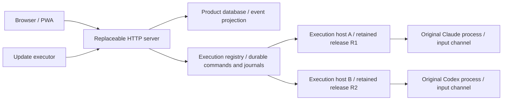

# Session lifecycle and independent application updates

Status: implemented for package installations. Deployment is separate from source
merge. The first migration from a legacy runner still requires an idle window;
source installations retain the legacy lifecycle.

## Ownership

A provider session is conversation history; an execution is one live invocation.
Preserving history or resuming a session does not prove an execution survived.
Every Palmagent-started invocation now has an execution host that owns its adapter,
child process, input channel, and normalized event journal until it finishes.
Application updates do not restart these hosts. Existing invocations keep their
original release; new invocations use the activated release.

External terminal sessions remain externally owned. Previewing their transcripts,
reconnecting a browser, or deploying Palmagent never transfers ownership or sends
a resume command. Existing native-session ownership checks remain in effect.



The execution control boundary uses a shared SQLite registry instead of a separate
long-lived control daemon. Web clients and finishing hosts reconcile admission
through transactions. Journals are logically separated by execution in that
registry, rather than stored in one database file per invocation. This keeps the
execution database separate from product migrations without another service that
could become a shared restart dependency.

## Process and artifact boundaries

`palmagent.service` serves HTTP and the PWA. Each invocation runs under its own
`palmagent-execution@<uuid>.service`, with no `PartOf`, `BindsTo`, or restart
relationship to the web service. Systemd owns its cgroup with `KillMode=control-group`
and `Restart=no`. A failed execution host is never automatically respawned into
a second provider invocation. Aggregate execution resource limits live in
`palmagent-executions.slice`.

The installation owner can invoke a bounded root-owned helper that accepts only
one execution UUID and starts its corresponding unprivileged service. It cannot
supply arbitrary commands, unit properties, or another unit name. Provider adapters
and CLIs run as the installation owner, not root.

The small launcher reads a private descriptor and verifies the invocation ID,
protocol, owner, release root, and runtime root. Every invocation pins the retained
Palmagent package tree and a content-addressed Node executable. The host makes an
exclusive durable claim before starting the provider, so a repeated start request
cannot duplicate a run. Provider CLI installations remain externally managed;
Palmagent updates do not change them. Operator changes to those CLI installations
are outside this update guarantee.

The first package activation snapshots its complete installed package. Later
updates use a new npm prefix under the installation's releases directory. They
never overwrite a tree referenced by an execution. The global CLI forwards to
the active retained release. Completed journals, releases, and runtimes are
currently retained; no automatic garbage collection is implemented. Operators
must account for their disk usage and must not remove referenced artifacts.

## Durable control and recovery

The execution database uses WAL, full synchronous writes, a busy timeout, and a
versioned schema. It contains admission reservations, execution identities,
normalized events with monotonic per-execution sequence numbers, pending provider
questions, typed command receipts, and persisted legacy stop/steer intent.
Shared wire schemas live in `packages/shared`.

Admission enforces a global concurrency limit and exclusive task/provider-owner
reservations. A host claims its reservation with its PID, boot identity, and
process start identity. Queued cancellation and admission serialize through the
same database. Uncertain starts retain their reservation for reconciliation.
Closing the web client never settles a run or closes the provider's stdin.

Commands support send, steer, answer, approval, interrupt, and cancel. A repeated
command ID with the same content returns its existing receipt; different content
is rejected. Answers must match the persisted request ID. A claimed command with
an uncertain delivery result is not automatically resent: a provider write and a
SQLite receipt cannot be committed atomically. The product message queue already
holds uncertain delivery for review.

A replacement web process attaches to the existing journal, including invocations
that completed while it was absent. Replay rebuilds terminal bookkeeping while
the product cursor prevents duplicate events and repeated questions. Provider
session mismatches are rejected inside the execution host, including when no web
client is connected. A confirmed lost host produces an abnormal exit; it does not
create a replacement invocation. Store or identity access errors retain ownership.

File notifications trigger reconciliation. A one-second repair interval covers
missed filesystem notifications for local execution state; it never checks release
availability. Releases are checked only on app connection/foreground return or an
explicit check, with the existing access cache.

## Update activation

1. Resolve and retain one exact compatible version under the existing update lock.
2. Install it into a new prefix and verify package identity, CLI identity, required
   runtime files, and the execution, storage, and application API contracts.
3. Enter the existing short admission barrier and require the live web server to
   acknowledge both maintenance and independent execution support. Existing runs
   and provider input channels remain active.
4. Record previous and target configuration atomically. Install the application
   units, save the selected release atomically, and restart only the web service.
5. Verify the exact running version and health. Update the one-shot executor's
   release reference and record success. The PWA prepares its service worker,
   checkpoints per-tab state, and switches at a quiet moment automatically.

There is no distributed atomic transaction across npm, systemd, SQLite, browser
storage, or plugin managers. The user sees one automatic update flow; running
invocations retain their own immutable references throughout. A browser stream
may briefly disconnect. Drafts, attachments, forms, and scroll position use the
existing per-tab checkpoint; in-flight submissions and composition delay refresh.

Candidates currently require execution protocol, product storage, and application
API version 1. Future releases must maintain these compatibility contracts or add
an explicit migration path before advancing them. An incompatible candidate is
rejected before activation. The execution database is not migrated by web startup.

On activation failure, the updater attempts to restore the previous application
units/configuration and checks their health. The activation receipt distinguishes
`restored` from `recovery-required`; the failed update pauses unattended retries.
Both releases remain available. This is application restoration, not a database
rollback. A killed updater may require receipt-guided manual recovery; it must not
silently erase the hold or restart execution units.

## Legacy migration

A live CLI owned by the old runner cannot safely be moved into an independent
host with its original input channel. The old installation must finish its work
naturally. Its idle check and maintenance barrier stay in place for the first
package upgrade. Activation then installs independent execution units, retains
the new package/runtime, and configures the web server to use them. Subsequent
compatible updates no longer wait for active, queued, or waiting independent runs.

The obsolete runner is not an execution authority after migration. Source setups
still use the runner or explicitly selected in-process development backend and
retain their idle update guard. A configured but unreachable daemon now fails
startup rather than silently moving provider ownership into the web process.

## Verification

Hermetic execution tests launch real child processes using fixture Claude and
Codex protocols, with isolated homes, repositories, and state. They assert the
same provider PID/session and release across client replacement, output persistence
without a view, question delivery through the original stdin, duplicate command
rejection, and admission ownership. HTTP lifecycle tests restart the complete web
server and verify pending input and exactly-once product projection after offline
completion. Updater tests keep running/waiting tasks and active execution records
while verifying that only the web service is restarted and old artifacts survive.
These fixtures do not invoke authenticated provider services.

After `pnpm pkg:build`, explicitly run the packed systemd acceptance test on a
Linux test host with non-interactive sudo:

```bash
pnpm exec tsx apps/server/scripts/execution-systemd-smoke.ts
```

It creates uniquely named temporary units and isolated fixture state, replaces
the web service with a second retained package tree, and verifies original agent
PIDs, sessions, artifacts, and pending input. It removes only its own test units
and data. It does not deploy or restart installed Palmagent services.
