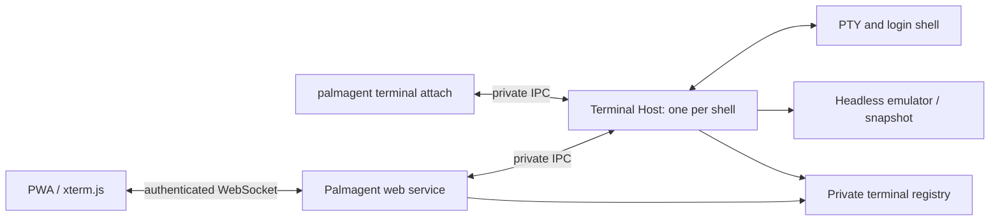

# Shell access

Open **Terminals** from navigation, choose a Space, and press **New terminal**.
Within a Task, choose **Open terminal** from Task actions. A Task shell starts in
its worktree; a Space shell starts in the repository directory.

Desktop shows the conversation and terminal together. Mobile switches between
them and provides Ctrl+C, Tab, Esc, and arrow keys above the safe area.
An idle terminal enables input automatically; tap the terminal to open the keyboard.
If another screen is using it, output remains visible and **Type here** moves input
to this screen. Simply viewing or focusing a terminal never takes another screen's
input. CLI attach explicitly takes input from other viewers.

The **Terminal actions** menu contains rename, **View read-only**, terminal details
(including the full starting directory), and termination. Read-only mode stays on
for that terminal in this view across reconnects and terminal switches. Choose
**Type here** or **Enable input** to leave it; other screens' preferences are unchanged.

Returning to the conversation, closing a tab, losing connectivity, and updating
Palmagent leave the shell running. Reconnecting restores the current screen and
bounded scrollback, including an application's alternate screen. Reconnect enables
input only if no other screen owns it and this view is not explicitly read-only.
Keystrokes entered while disconnected are never replayed. Existing shells started
by older Palmagent versions still support **Type here**, but require that explicit
action until a new shell is started. **Terminate terminal** ends the
shell and its child processes.

The installation owner can also use:

```sh
palmagent terminal diagnose
palmagent terminal list
palmagent terminal create --repo <space-id>
palmagent terminal create --task <task-id> --title "Development"
palmagent terminal attach <terminal-id>
palmagent terminal rename <terminal-id> --title "Tests"
palmagent terminal terminate <terminal-id>
```

Use Ctrl+] to detach from the CLI. Attach requires a TTY and claims input control.
Add `--data-dir <directory>` for a non-default installation. Creation accepts a
`--request-id <uuid>` for retries that must return the same shell.

## Installation and scope

The public npm package remains **palmagent**. Its package dependencies supply
node-pty and the terminal emulators; no tmux, ttyd, separate terminal daemon package,
or extra user-managed process is required. The Linux package installer provisions
the host services and private IPC. Normal Node/npm and host setup prerequisites
still apply, including native-module build tools on targets without prebuilt binaries.

The first supported platform is Linux with systemd and an unprivileged installation
owner. Run the normal Palmagent setup/update flow to install its terminal services.
Source-mode installations and other OSes report the feature as unavailable.
Browser shell access requires enabled sign-in. Commands run with the installation
owner's host permissions in the owner's login shell.

Shells survive application restarts, not machine reboots or termination of their
own service. Screen state is bounded in memory and is not an audit log.
Cancellation or archival of a Task defers worktree removal while a terminal that
started there remains active. Moving a shell into another directory does not
transfer that retention claim. Removing a Space or uninstalling Palmagent requires
its active shells to finish. Existing native agent-session handoff is unchanged;
this feature opens independent general-purpose shells.

## Architecture



- Shared schemas own REST, attach tickets, input epochs, frame sequence numbers,
  screen dimensions, and capability discovery. Clients do not branch on the host OS.
- `TerminalDriver`, `TerminalSupervisor`, `LocalTransport`, and `ShellResolver`
  isolate platform behavior. `terminalPlatform` is the selection boundary. Future
  macOS or Windows support supplies its own supervision, IPC, shell discovery, and
  installation integration while reusing the registry, host protocol, service, and UI.
  They are extension points, not claims of current support.
- Linux uses node-pty, systemd template services, and owner-only Unix sockets.
  Terminals belong to their own resource-limited slice and use full control-group
  termination. They have no restart or dependency coupling to the web service.
- Each terminal reserves an idempotent registry entry before launch, pins its
  immutable package and Node runtime, and claims a single host process. An uncertain
  launch retains its reservation; reconciliation never silently creates a new shell.
  Updates check the terminal protocol and retained artifacts before activation.
- The host serializes PTY output, resize, snapshots, and control changes. It alone
  answers terminal queries. A writer epoch fences input and resizing from old
  controllers. Slow clients disconnect and restore from a fresh snapshot; PTY parsing
  uses pause/resume flow control.
- Browser upgrades independently enforce exact Origin, a live login session, and a
  short-lived single-use ticket sent in the first frame. No ticket is placed in URLs.
  Session revocation is checked on traffic and heartbeats. Clipboard escape sequences
  are not passed through. CLI access relies on installation ownership and private IPC.
- Worktree cleanup and terminal reservation share a SQLite write lock. Only a
  supervisor-confirmed stopped service releases retention; unknown state stays pinned.
  Browser disconnect and application shutdown only detach clients.

The current limits are 16 active user terminals per installation, 8 attachments per
terminal, 2,000 scrollback lines, and bounded frames, socket buffers, and input rates.
Retained package artifacts are not garbage-collected by this feature.

## Repair missing terminal services

If a package upgrade leaves a shell at “Starting”, run `palmagent setup` as the installation
owner with the installation's data directory. This reapplies terminal services and the nginx
WebSocket route. A pending request retries with its original terminal ID within the 30-second
startup deadline. After the deadline, Palmagent stops its process group and reports the failure;
open a new terminal after repairing the installation. Uncertain termination keeps the original
reservation and its worktree pinned until the service confirms it has stopped.
Application updates provision services using the incoming package's own installer.

## Diagnose the full connection

Run `palmagent terminal diagnose` as the installation owner. `palmagent doctor` also performs
this check on package installations with retained runtimes. It verifies service permissions,
starts a disposable shell in a temporary directory, executes a marker through the installation's
public authenticated WebSocket route, then reconnects and verifies the restored screen.
A local health response alone cannot prove that the public WebSocket route works.

The diagnostic needs the configured HTTPS origin to be reachable from the installation host.
It uses a temporary login session and one separate diagnostic slot, so existing user terminals
are unaffected and a full user-terminal list does not block the check. Updates and concurrent
diagnostics are serialized. The result contains check names, without shell output or credentials.

On completion or failure, it revokes the temporary session and stops the diagnostic process
group before removing its registry entry and scratch directory. If stopping cannot be confirmed,
the check fails and leaves the terminal visible for inspection with `palmagent terminal list`
and termination by ID. If the diagnostic CLI is killed, its host expires after two minutes;
the temporary login session also expires within two minutes.
